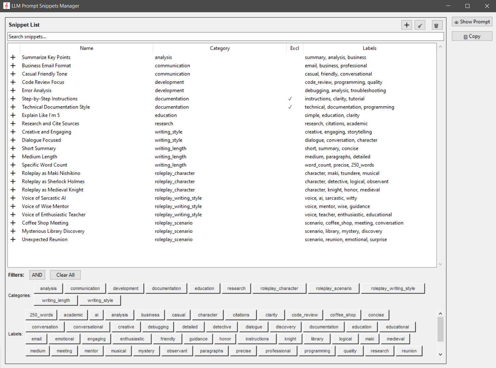
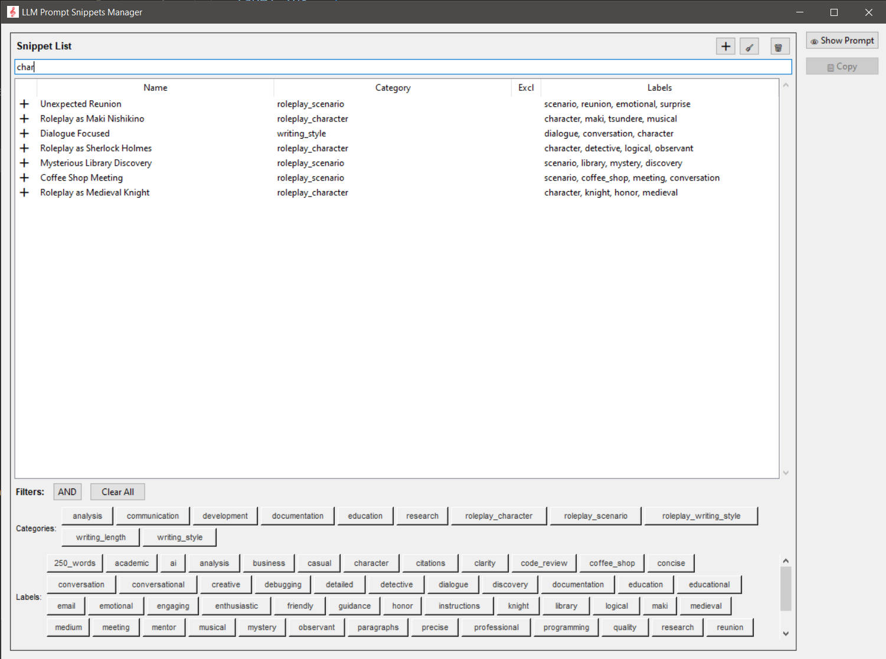
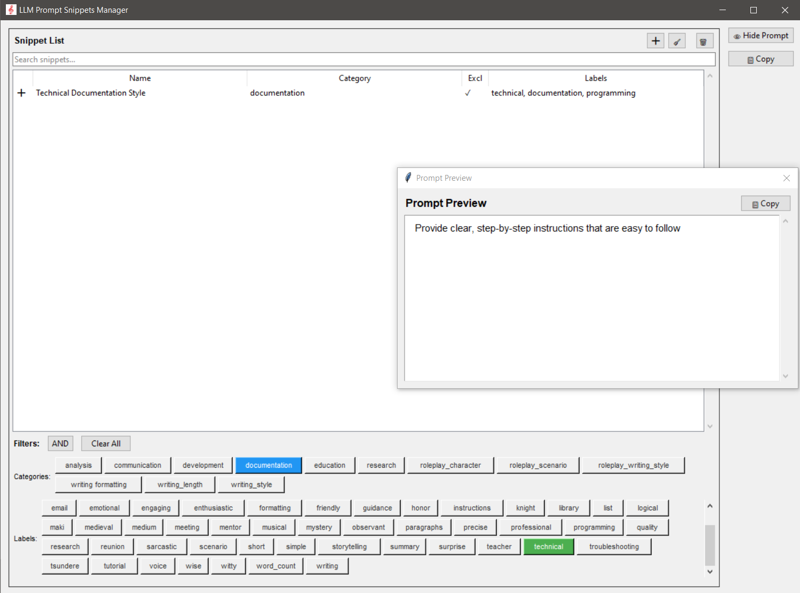
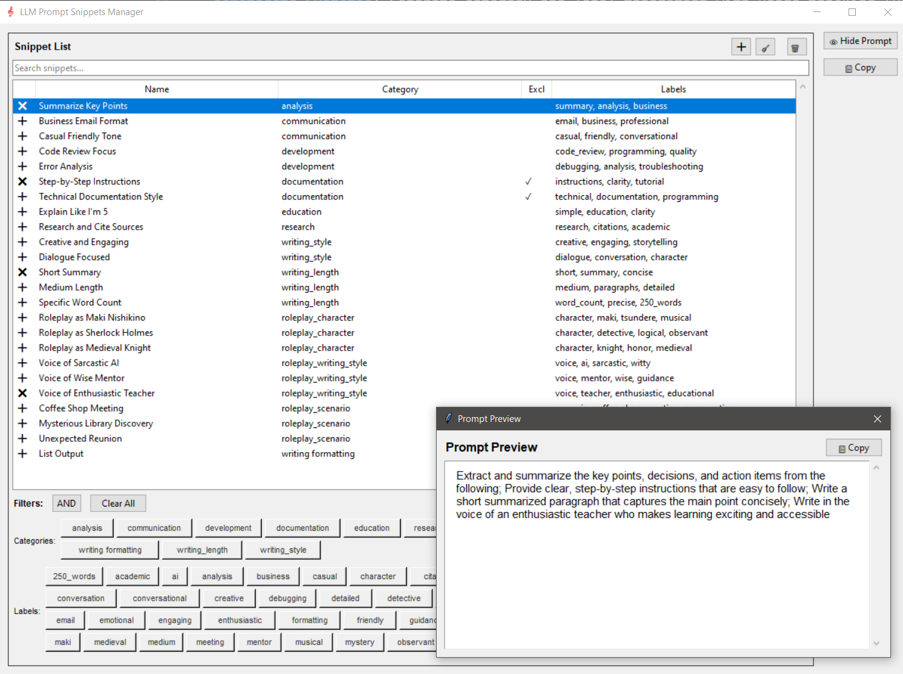
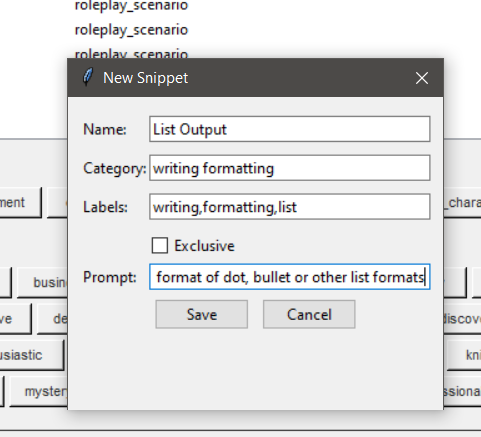

# LLM Prompt Snippets Manager

A professional Python desktop application built with Tkinter for managing LLM prompt snippets. This application provides a robust system for storing, organizing, and combining text snippets into complete prompts for AI interactions, with advanced filtering, state management, and professional logging.

## ✨ Key Features

### Core Functionality
- **Smart Snippet Management**: Create, edit, and delete snippets with rich metadata (categories, labels, exclusivity rules)
- **Advanced Filtering**: Multi-level filtering by categories, labels, and text search with AND/OR logic
- **Intelligent State Management**: Preserves selections and filters across operations
- **Professional Preview**: Clean prompt preview and copy functionality with proper text formatting
- **UUID-Based Architecture**: Robust backend with unique identifiers and referential integrity

### User Experience
- **Modern UI**: Clean, intuitive interface with visual feedback and tooltips
- **Smart Refresh**: Operations preserve user selections and active filters
- **Professional Logging**: Structured logging system with user-friendly and debug modes
- **Debug Mode**: Development tools for testing and debugging (via `debug.py`)
- **Clipboard Integration**: One-click copying of formatted prompts

### Data Management
- **Metadata System**: Separate category and label management with usage tracking (Partially Implemented)
- **Automatic Validation**: Startup validation ensures data integrity
- **Backup-Safe**: Robust JSON persistence with error handling

## � Screenshots

### Main Interface

*Clean, intuitive interface showing snippet management with categories and labels*

### Advanced Search and Filtering

*Powerful search with real-time filtering across snippet content, categories, and labels*

### Category and Label Filtering

*Smart bubble filtering with AND/OR logic for precise snippet selection*

### Prompt Preview and Copy

*Clean prompt preview window with formatted output and clipboard integration*

### Add/Edit Snippet Dialog

*User-friendly dialog for creating and editing snippets with metadata*

## �📁 Project Structure

```
Prompt Snippets/
├── main.py                    # Entry point (production mode)
├── debug.py                   # Entry point with debug features enabled
├── gui/                       # GUI components and user interface
│   ├── __init__.py
│   ├── app.py                 # Main application window and orchestration
│   ├── snippet_list.py        # Advanced snippet list with filtering and state management
│   ├── snippet_dialog.py      # Modal dialog for creating/editing snippets
│   ├── prompt_window.py       # Separate prompt preview window
│   └── preview_pane.py        # Embedded preview pane component
├── models/                    # Data models and business logic
│   ├── __init__.py
│   ├── snippet.py             # Snippet data model with validation
│   ├── data_manager.py        # JSON persistence and data operations
│   ├── metadata_manager.py    # Category/label management with UUID system
│   └── snippet_state.py       # Selection and filtering state management
├── utils/                     # Utility modules and helpers
│   ├── __init__.py
│   ├── logger.py              # Professional logging system
│   ├── ui_utils.py            # UI helper functions (tooltips, styling)
│   └── state_utils.py         # State utility functions
├── data/                      # Data storage and configuration
│   ├── snippets.json          # Snippet data with UUID references (created on first launch)
│   ├── metadata.json          # Categories and labels with usage tracking  (created on first launch)
│   └── sample_snippets.json   # Sample data for new installations
├── docs/                      # Documentation and screenshots
│   └── images/                # Screenshots for README
│       ├── main-interface.png
│       ├── search-functionality.png
│       ├── category_label-filtering.png
│       ├── prompt-preview.png
│       └── add-edit-new-snippet.png
├── assets/                    # Application assets
│   └── icons/                 # Application icons
│       └── app_icon.ico       # Main application icon
├── REUSABLE_FUNCTIONS.md      # Developer documentation for reusable components
├── requirements.txt           # Python dependencies (standard library only)
└── README.md                  # This documentation
```

## 🚀 Setup Instructions

1. **Clone the repository:**
   ```bash
   git clone https://github.com/EpharGy/llm-prompt-snippets-manager.git
   cd llm-prompt-snippets-manager
   ```

2. **Run the application:**
   
   **Production Mode (Clean UI):**
   ```bash
   python main.py
   ```
   
   **Development Mode (With debug features):**
   ```bash
   python debug.py
   ```

   **Note**: This application uses only Python standard library modules, so no additional package installation is required!

3. **First Run:**
   - The application automatically creates the `data/` directory
   - Sample snippets are loaded to help you get started
   - All data is saved automatically as you work

## 📖 Usage Guidelines

### Creating and Managing Snippets
- **Add New Snippets**: Click the ➕ button or use the snippet dialog
- **Edit Existing**: Double-click any snippet to edit it
- **Rich Metadata**: Assign categories, labels, and exclusivity rules
- **Smart Validation**: The system ensures data integrity and prevents conflicts

### Advanced Filtering and Search
- **Text Search**: Use the search bar to find snippets by any content
- **Category Filters**: Click category bubbles to filter by categories
- **Label Filters**: Click label bubbles to filter by labels  
- **AND/OR Logic**: Toggle filter mode for different matching behavior
- **Filter Persistence**: Filters and selections are preserved during operations

### Working with Combined Prompts
- **Multi-Selection**: Select multiple snippets to combine them
- **Smart Preview**: See formatted output in the preview window
- **Clean Copy**: Copy properly formatted text to clipboard
- **Exclusivity Rules**: Exclusive snippets prevent conflicts automatically

### Professional Features
- **State Management**: Your selections and filters persist across operations
- **Logging**: Professional logging provides helpful feedback and debugging
- **Data Integrity**: Automatic validation ensures consistent data
- **Developer Tools**: Use `debug.py` for development and testing

## 🔧 Technical Architecture

### Data Model
- **UUID-Based System**: All categories and labels use unique identifiers
- **Referential Integrity**: Automatic validation prevents orphaned references
- **Metadata Management**: Separate tracking of categories and labels with usage statistics
- **JSON Persistence**: Human-readable data storage with backup safety

### State Management
- **Smart Refresh**: UI updates preserve user selections and active filters
- **Selection Tracking**: Robust state management for multi-snippet operations
- **Filter Persistence**: Active filters maintained across data operations
- **Conflict Resolution**: Automatic handling of exclusive snippet selections

### Logging System
- **Structured Logging**: Professional logging with multiple levels (INFO, DEBUG, ERROR)
- **User-Friendly Messages**: Clear feedback for user operations with emoji indicators
- **Debug Support**: Detailed logging for troubleshooting and development
- **Configurable Verbosity**: Different logging levels for production vs development

## 💻 Development

### Debug Mode
Enable development features by running:
```bash
python debug.py
```
This provides:
- Test snippet generation buttons (T1, T2)
- Additional debug logging
- Development utilities

### For Developers
- **Reusable Components**: See `REUSABLE_FUNCTIONS.md` for documented patterns
- **Clean Architecture**: Separation of concerns between GUI, models, and utilities
- **State Patterns**: Well-documented state management patterns for future features
- **Logging Standards**: Consistent logging patterns throughout the codebase

## 📋 Data Storage

### File Structure
- **`data/snippets.json`**: All snippet data with UUID references to metadata
- **`data/metadata.json`**: Categories and labels with usage tracking and sort order
- **`data/sample_snippets.json`**: Clean sample data loaded on first run (string-based format)

### Backup and Safety
- Automatic data validation on startup
- Referential integrity checks prevent data corruption  
- Human-readable JSON format for manual inspection if needed
- Usage count tracking for categories and labels

## 🔄 Requirements

- **Python 3.7+**: No external dependencies required
- **Operating System**: Windows, macOS, Linux (Tkinter included with Python)
- **Memory**: Minimal requirements - designed for efficiency
- **Storage**: Small footprint - JSON-based data storage

## 🤝 Contributing

Contributions are welcome! Please:
1. Check `REUSABLE_FUNCTIONS.md` for existing patterns before implementing new features
2. Follow the established logging patterns for consistency
3. Maintain the clean separation between GUI, models, and utilities
4. Submit pull requests with clear descriptions of changes

For major changes, please open an issue first to discuss the proposed modifications.

## 📄 License

This project is licensed under the MIT License. See the repository for more details.

---

*Crafted with ❤️ for AI enthusiasts who want better prompt management by Maki-chan* 🎀
